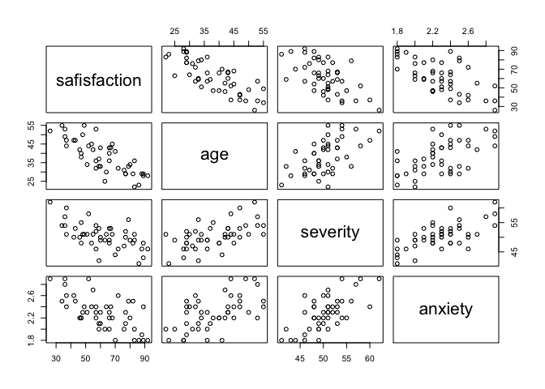

Methods\_hw4
================
Yishan Wang
2018-11-12

Problem 2
=========

``` r
heartdisease_data = read_csv("./data/HeartDisease.csv")
```

    ## Parsed with column specification:
    ## cols(
    ##   id = col_integer(),
    ##   totalcost = col_double(),
    ##   age = col_integer(),
    ##   gender = col_integer(),
    ##   interventions = col_integer(),
    ##   drugs = col_integer(),
    ##   ERvisits = col_integer(),
    ##   complications = col_integer(),
    ##   comorbidities = col_integer(),
    ##   duration = col_integer()
    ## )

### a)

#### Description of the Data Set

The main outcome is `totalcost` of patients diagnosed with heart disease. The main predictor is `ERvisits`, which is number of emergency room visits. Other important covariates are `age`, `gender`, `complications` and `duration`. `interventions`, `drugs` and `comorbidities` are potential covariates.

#### Descriptive Statistics for all Variables of Interest

##### Descriptive statistics for continous variables of interest:

``` r
heartdisease_data %>%
  select(totalcost, ERvisits, age, complications, duration) %>%
  summary() %>%
  knitr::kable(digits = 1)
```

|     |    totalcost    |    ERvisits    |      age      | complications   |    duration    |
|-----|:---------------:|:--------------:|:-------------:|:----------------|:--------------:|
|     |    Min. : 0.0   |  Min. : 0.000  |  Min. :24.00  | Min. :0.00000   |   Min. : 0.00  |
|     |  1st Qu.: 161.1 | 1st Qu.: 2.000 | 1st Qu.:55.00 | 1st Qu.:0.00000 | 1st Qu.: 41.75 |
|     |  Median : 507.2 | Median : 3.000 | Median :60.00 | Median :0.00000 | Median :165.50 |
|     |  Mean : 2800.0  |  Mean : 3.425  |  Mean :58.72  | Mean :0.05711   |  Mean :164.03  |
|     | 3rd Qu.: 1905.5 | 3rd Qu.: 5.000 | 3rd Qu.:64.00 | 3rd Qu.:0.00000 | 3rd Qu.:281.00 |
|     |  Max. :52664.9  |  Max. :20.000  |  Max. :70.00  | Max. :3.00000   |  Max. :372.00  |

##### Descriptive statistics for categorical variable of interest:

``` r
table(factor(heartdisease_data$gender, levels = c(1, 0), labels = c('Male', 'Female'))) %>%
  addmargins() %>%
  knitr::kable(digits = 1)
```

| Var1   |  Freq|
|:-------|-----:|
| Male   |   180|
| Female |   608|
| Sum    |   788|

### b)

#### Plot the distribution for variable `totalcost`:

``` r
hist(heartdisease_data$totalcost, main = "Total Cost Distribution", xlab = "Total Cost ($)", col.main = "red", col.lab = "blue")
```


#### Use log transformation:

``` r
hist(log(heartdisease_data$totalcost), main = "Total Cost Distribution", xlab = "Total Cost ($)", col.main = "red", col.lab = "blue")
```


### c)

#### Create a new variable called `comp_bin` by dichotomizing `complications`: 0 if no complications, and 1 otherwise.

``` r
new_heartdisease_data = heartdisease_data %>%
  mutate(comp_bin = as.factor(ifelse(complications == 0, 0, 1))) %>%
  mutate(gender = as.factor(gender))
```

### d)

#### Fit a simple linear regression between the original `totalcost` and predictor `ERvisits`.

Ho: beta\_ERvisits = 0

Ha: beta\_ERvisits != 0

Model: totolcost = beta\_0 + beta\_ERvisits \* ERvisits

``` r
ggplot(heartdisease_data, aes(x = ERvisits, y = totalcost)) +
  geom_point() +
  geom_smooth(method = 'lm', formula = y~x)
```


``` r
reg_original_slr = lm(totalcost ~ ERvisits, heartdisease_data)
summary(reg_original_slr)
```

    ## 
    ## Call:
    ## lm(formula = totalcost ~ ERvisits, data = heartdisease_data)
    ## 
    ## Residuals:
    ##    Min     1Q Median     3Q    Max 
    ## -15733  -2353  -1062    185  42098 
    ## 
    ## Coefficients:
    ##             Estimate Std. Error t value Pr(>|t|)    
    ## (Intercept)  -472.54     362.24  -1.304    0.192    
    ## ERvisits      955.44      83.81  11.399   <2e-16 ***
    ## ---
    ## Signif. codes:  0 '***' 0.001 '**' 0.01 '*' 0.05 '.' 0.1 ' ' 1
    ## 
    ## Residual standard error: 6201 on 786 degrees of freedom
    ## Multiple R-squared:  0.1419, Adjusted R-squared:  0.1408 
    ## F-statistic: 129.9 on 1 and 786 DF,  p-value: < 2.2e-16

##### Comments on significance and interpretation of the slope:

-   From the p-value of the F test, we can conclude that the test is significant and there is a linear relationship between `totalcost` and `ERvisits`, and `ERvisits` is a significant predictor of `totalcost`. But only 14% of variation of `totalcost` around its mean can be explained by the model.

-   We expect the total cost will increase $955.44 on average if the number of emergency room (ER) visits increase 1 more time.

#### Fit a simple linear regression between the transformed `totalcost` and predictor `ERvisits`.

Ho: beta\_ERvisits = 0

Ha: beta\_ERvisits != 0

Model: trans\_totolcost = beta\_0 + beta\_ERvisits \* ERvisits

``` r
trans_heartdisease_data = heartdisease_data %>%
  filter(totalcost != 0) %>%
  mutate(trans_totalcost = log(totalcost)) %>%
  mutate(comp_bin = as.factor(ifelse(complications == 0, 0, 1))) %>%
  mutate(gender = as.factor(gender))

ggplot(trans_heartdisease_data, aes(x = ERvisits, y = trans_totalcost)) +
  geom_point() +
  geom_smooth(method = 'lm', formula = y~x)
```


``` r
reg_trans_slr = lm(trans_totalcost ~ ERvisits, trans_heartdisease_data)
summary(reg_trans_slr)
```

    ## 
    ## Call:
    ## lm(formula = trans_totalcost ~ ERvisits, data = trans_heartdisease_data)
    ## 
    ## Residuals:
    ##     Min      1Q  Median      3Q     Max 
    ## -6.2013 -1.1265  0.0191  1.2668  4.2797 
    ## 
    ## Coefficients:
    ##             Estimate Std. Error t value Pr(>|t|)    
    ## (Intercept)  5.53771    0.10362   53.44   <2e-16 ***
    ## ERvisits     0.22672    0.02397    9.46   <2e-16 ***
    ## ---
    ## Signif. codes:  0 '***' 0.001 '**' 0.01 '*' 0.05 '.' 0.1 ' ' 1
    ## 
    ## Residual standard error: 1.772 on 783 degrees of freedom
    ## Multiple R-squared:  0.1026, Adjusted R-squared:  0.1014 
    ## F-statistic:  89.5 on 1 and 783 DF,  p-value: < 2.2e-16

##### Comments on significance and interpretation of the slope:

-   From the p-value of the F test, we can conclude that the test is significant and there is a linear relationship between the transformed `totalcost` and `ERvisits`, and `ERvisits` is a significant predictor of the transformed `totalcost`. But only 10% of variation of the transformed `totalcost` around its mean can be explained by the model.

-   We expect the total cost will increase exp(0.23 + 5.54) = $321 on average if the number of emergency room (ER) visits increase 1 more time.

### e)

#### Fit a multiple linear regression with `comp_bin` and `ERvisits` as predictors.

Ho: beta\_ERvisits = beta\_comp\_bin = 0

Ha: at lease one beta is not 0

Model: trans\_totolcost = beta\_0 + beta\_ERvisits \* ERvisits + beta\_comp\_bin \* comp\_bin

``` r
reg_trans_mlr = lm(trans_totalcost ~ ERvisits + comp_bin, trans_heartdisease_data)
summary(reg_trans_mlr)
```

    ## 
    ## Call:
    ## lm(formula = trans_totalcost ~ ERvisits + comp_bin, data = trans_heartdisease_data)
    ## 
    ## Residuals:
    ##     Min      1Q  Median      3Q     Max 
    ## -6.0741 -1.0737 -0.0181  1.1810  4.3848 
    ## 
    ## Coefficients:
    ##             Estimate Std. Error t value Pr(>|t|)    
    ## (Intercept)   5.5211     0.1013  54.495  < 2e-16 ***
    ## ERvisits      0.2046     0.0237   8.633  < 2e-16 ***
    ## comp_bin1     1.6859     0.2749   6.132 1.38e-09 ***
    ## ---
    ## Signif. codes:  0 '***' 0.001 '**' 0.01 '*' 0.05 '.' 0.1 ' ' 1
    ## 
    ## Residual standard error: 1.732 on 782 degrees of freedom
    ## Multiple R-squared:  0.1437, Adjusted R-squared:  0.1416 
    ## F-statistic: 65.64 on 2 and 782 DF,  p-value: < 2.2e-16

##### I)

##### Test if `comp_bin` is an effect modifier of the relationship between `totalcost` and `ERvisits`.

Ho: beta\_ERvisits = beta\_comp\_bin = beta\_ERvisits&comp\_bin = 0

Ha: at lease one beta is not 0

Model: trans\_totolcost = beta\_0 + beta\_ERvisits \* ERvisits + beta\_comp\_bin \* comp\_bin + beta\_ERvisits&comp\_bin \* ERvisits&comp\_bin

``` r
reg_interaction = lm(trans_totalcost ~ ERvisits + comp_bin + ERvisits * comp_bin, trans_heartdisease_data)
summary(reg_interaction)
```

    ## 
    ## Call:
    ## lm(formula = trans_totalcost ~ ERvisits + comp_bin + ERvisits * 
    ##     comp_bin, data = trans_heartdisease_data)
    ## 
    ## Residuals:
    ##     Min      1Q  Median      3Q     Max 
    ## -6.0852 -1.0802 -0.0078  1.1898  4.3803 
    ## 
    ## Coefficients:
    ##                    Estimate Std. Error t value Pr(>|t|)    
    ## (Intercept)         5.49899    0.10349  53.138  < 2e-16 ***
    ## ERvisits            0.21125    0.02453   8.610  < 2e-16 ***
    ## comp_bin1           2.17969    0.54604   3.992 7.17e-05 ***
    ## ERvisits:comp_bin1 -0.09927    0.09483  -1.047    0.296    
    ## ---
    ## Signif. codes:  0 '***' 0.001 '**' 0.01 '*' 0.05 '.' 0.1 ' ' 1
    ## 
    ## Residual standard error: 1.732 on 781 degrees of freedom
    ## Multiple R-squared:  0.1449, Adjusted R-squared:  0.1417 
    ## F-statistic: 44.13 on 3 and 781 DF,  p-value: < 2.2e-16

##### Comment

Since the p-value of 'ERvisits:comp\_bin1' is greater than 0.05, `comp_bin` is not an effect modifier of the relationship between `totalcost` and `ERvisits`

##### II)

##### Test if `comp_bin` is a confounder of the relationship between `totalcost` and `ERvisits`.

|beta\_ERvisits\_slr - beta\_ERvisits\_mlr| / beta\_ERvisits\_slr = |0.23 - 0.20| / 0.23 = 0.13, which is greater than 10%, so `comp_bin` is a confounder of the relationship between `totalcost` and `ERvisits`.

##### III)

##### Decide if `comp_bin` should be included along with ‘ERvisits.

Ho: beta\_comp\_bin = 0

Ha: beta\_comp\_bin != 0

``` r
anova(reg_trans_slr, reg_trans_mlr)
```

    ## Analysis of Variance Table
    ## 
    ## Model 1: trans_totalcost ~ ERvisits
    ## Model 2: trans_totalcost ~ ERvisits + comp_bin
    ##   Res.Df    RSS Df Sum of Sq      F    Pr(>F)    
    ## 1    783 2459.8                                  
    ## 2    782 2347.0  1    112.84 37.598 1.379e-09 ***
    ## ---
    ## Signif. codes:  0 '***' 0.001 '**' 0.01 '*' 0.05 '.' 0.1 ' ' 1

##### Reason

`comp_bin` should be included along with ‘ERvisits because the p-value of the F test is less than 0.05 and it indicates that beta\_camp\_bin is not equal to 0 and `comp_bin` is significant to predict `totalcost`.

### f)

##### I)

##### Use the model in part e) and add additional covariates and fit MLR.

Ho: beta\_ERvisits = beta\_comp\_bin = beta\_age = beta\_gender = beta\_duration = 0

Ha: at lease one beta is not 0

Model: trans\_totolcost = beta\_0 + beta\_ERvisits \* ERvisits + beta\_comp\_bin \* comp\_bin + beta\_age \* age + beta\_gender \* gender + beta\_duration \* duration

``` r
full_model = lm(trans_totalcost ~ ERvisits + comp_bin + age + gender + duration, trans_heartdisease_data)
summary(full_model)
```

    ## 
    ## Call:
    ## lm(formula = trans_totalcost ~ ERvisits + comp_bin + age + gender + 
    ##     duration, data = trans_heartdisease_data)
    ## 
    ## Residuals:
    ##     Min      1Q  Median      3Q     Max 
    ## -5.0823 -1.0555 -0.1352  0.9533  4.3462 
    ## 
    ## Coefficients:
    ##               Estimate Std. Error t value Pr(>|t|)    
    ## (Intercept)  6.0449619  0.5063454  11.938  < 2e-16 ***
    ## ERvisits     0.1757486  0.0223189   7.874 1.15e-14 ***
    ## comp_bin1    1.4921110  0.2554883   5.840 7.65e-09 ***
    ## age         -0.0221376  0.0086023  -2.573   0.0103 *  
    ## gender1     -0.1176181  0.1379809  -0.852   0.3942    
    ## duration     0.0055406  0.0004848  11.428  < 2e-16 ***
    ## ---
    ## Signif. codes:  0 '***' 0.001 '**' 0.01 '*' 0.05 '.' 0.1 ' ' 1
    ## 
    ## Residual standard error: 1.605 on 779 degrees of freedom
    ## Multiple R-squared:  0.268,  Adjusted R-squared:  0.2633 
    ## F-statistic: 57.03 on 5 and 779 DF,  p-value: < 2.2e-16

##### Comment

-   From the p-value of the F test, we can conclude that the test is significant and there is a linear relationship between the transformed `totalcost` and `ERvisits`, `comp_bin`, `age`, `gender`, `duration`.

-   `ERvisits`, `comp_bin`, `age`, and `duration` are significant predictors of the transformed `totalcost`. But `gender` is not significant predictors of the transformed `totalcost`.

-   27% of the variation of the transformed `totalcost` around its mean can be explained by the multiple linear regression model.

##### II)

Ho: beta\_comp\_bin = beta\_age = beta\_gender = beta\_duration = 0

Ha: at lease one beta is not 0

``` r
anova(reg_trans_slr, full_model)
```

    ## Analysis of Variance Table
    ## 
    ## Model 1: trans_totalcost ~ ERvisits
    ## Model 2: trans_totalcost ~ ERvisits + comp_bin + age + gender + duration
    ##   Res.Df    RSS Df Sum of Sq      F    Pr(>F)    
    ## 1    783 2459.8                                  
    ## 2    779 2006.5  4     453.3 43.996 < 2.2e-16 ***
    ## ---
    ## Signif. codes:  0 '***' 0.001 '**' 0.01 '*' 0.05 '.' 0.1 ' ' 1

I should use MLR than SLR because:

-   More variation of the transformed `totalcost` around its mean can be explained by the multiple linear regression model.

-   Since the p-value of F test is less than 0.05, there is at least one beta not equal to 0 among beta\_camp\_bin, beta\_age, beta\_gender, and beta\_duration.

Problem 3
=========

``` r
patsatisfaction_data = readxl::read_excel("./data/PatSatisfaction.xlsx") %>%
  janitor::clean_names()
```

### a)

#### Create a correlation matrix

``` r
Hmisc::rcorr(as.matrix(patsatisfaction_data))
```

    ##              safisfaction   age severity anxiety
    ## safisfaction         1.00 -0.79    -0.60   -0.64
    ## age                 -0.79  1.00     0.57    0.57
    ## severity            -0.60  0.57     1.00    0.67
    ## anxiety             -0.64  0.57     0.67    1.00
    ## 
    ## n= 46 
    ## 
    ## 
    ## P
    ##              safisfaction age severity anxiety
    ## safisfaction               0   0        0     
    ## age           0                0        0     
    ## severity      0            0            0     
    ## anxiety       0            0   0

``` r
pairs(patsatisfaction_data)
```



##### Initial Findings

-   Satisfaction and age have the strong negative association. Satisfication has the moderately strong negative association with both severity and anxiety.

-   Anxiety and severity have the moderately strong positive association, we might want to check **collinearity** later.

-   Severity and age have the moderately strong positive association, which is the same as the association between anxiety and age.

### b)

##### Fit a multiple regression model and test whether there is a regression relation and test whether there is a regression relation.

Ho: beta\_age = beta\_severity = beta\_anxiety = 0

Ha: at lease one beta is not 0

Model: satification = beta\_0 + beta\_age \* age + beta\_severity \* severity + beta\_anxiety \* anxiety

``` r
reg_mlr = lm(safisfaction ~ age + severity + anxiety, patsatisfaction_data)
summary(reg_mlr)
```

    ## 
    ## Call:
    ## lm(formula = safisfaction ~ age + severity + anxiety, data = patsatisfaction_data)
    ## 
    ## Residuals:
    ##      Min       1Q   Median       3Q      Max 
    ## -18.3524  -6.4230   0.5196   8.3715  17.1601 
    ## 
    ## Coefficients:
    ##             Estimate Std. Error t value Pr(>|t|)    
    ## (Intercept) 158.4913    18.1259   8.744 5.26e-11 ***
    ## age          -1.1416     0.2148  -5.315 3.81e-06 ***
    ## severity     -0.4420     0.4920  -0.898   0.3741    
    ## anxiety     -13.4702     7.0997  -1.897   0.0647 .  
    ## ---
    ## Signif. codes:  0 '***' 0.001 '**' 0.01 '*' 0.05 '.' 0.1 ' ' 1
    ## 
    ## Residual standard error: 10.06 on 42 degrees of freedom
    ## Multiple R-squared:  0.6822, Adjusted R-squared:  0.6595 
    ## F-statistic: 30.05 on 3 and 42 DF,  p-value: 1.542e-10

##### State the hypotheses, decision rule and conclusion.

Ho: beta\_age = beta\_severity = beta\_anxiety = 0

Ha: at least one beta is not 0

If the p-value is less than 0.05, we reject Ho and conclude that at least one beta is not 0 and there is a regression relation. If not, we do not reject Ho and conclude that beta\_age = beta\_severity = beta\_anxiety = 0 and there is not a regression relation.

Since p-value is far less than 0.05, we reject Ho and conclude that at least one beta is not 0 and there is a regression relation.

### c)

``` r
confint(reg_mlr, level = 0.95) %>%
  knitr::kable(digits = 1)
```

|             |  2.5 %|  97.5 %|
|-------------|------:|-------:|
| (Intercept) |  121.9|   195.1|
| age         |   -1.6|    -0.7|
| severity    |   -1.4|     0.6|
| anxiety     |  -27.8|     0.9|

-   The 95% CI for beta\_0 is (121.9, 195.1).

-   The 95% CI for beta\_age is (-1.6, -0.7).

-   The 95% CI for beta\_severity is (-1.4, 0.6).

-   The 95% CI for beta\_anxiety is (-27.8, 0.9).

##### Interpret the coefficient and 95% CI associated with `severity`.

-   The coefficient of `severity`: satisfaction will decrease by 0.442 units on average if severity increases by 1 unit adjusting age and anxiety constant.

-   We are 95% confident that satisfaction will differ between -1.4 units and 0.6 units on average if severity increases by 1 unit adjusting age and anxiety constant.

### d)

##### Obtain an interval estimate for a new patient’s satisfaction when Age = 35, Severity = 42, Anxiety = 2.1.

``` r
input_data = data.frame(age = 35, severity = 42, anxiety = 2.1)
predict(reg_mlr, input_data, interval = "predict")
```

    ##        fit      lwr      upr
    ## 1 71.68332 50.06237 93.30426

(beta\_0 + beta\_age \* age + beta\_severity \* severity + beta\_anxiety \* anxiety) +- t(alpha, n - 2) \* sqrt(MSE(1 + 1/n + (xh - xbar)^2 / sum((xi - xbar)^2)))

After pluging in the value, we have 95% prediction CI (50, 93).

##### Interpret

We are 95% confident that the next new satisfaction observation with age = 35, severity = 42, and anxiety = 2.1 is between 50 and 93.

### e)

##### Test whether `anxiety` can be dropped from the regression model, given the other two covariates are retained.

For linear model:

Ho: beta\_age = beta\_age = beta\_severity = 0

Ha: at least one beta is not 0

Model: safisfaction = beta\_0 + beta\_age \* age + beta\_severity \* severity

For ANOVA model:

Ho: beta\_anxiety = 0

Ha: beta\_anxiety != 0

``` r
reg_mlr_sub = lm(safisfaction ~ age + severity, patsatisfaction_data)
summary(reg_mlr_sub)
```

    ## 
    ## Call:
    ## lm(formula = safisfaction ~ age + severity, data = patsatisfaction_data)
    ## 
    ## Residuals:
    ##      Min       1Q   Median       3Q      Max 
    ## -17.1662  -8.5462  -0.4595   7.1342  17.2364 
    ## 
    ## Coefficients:
    ##             Estimate Std. Error t value Pr(>|t|)    
    ## (Intercept) 156.6719    18.6396   8.405 1.27e-10 ***
    ## age          -1.2677     0.2104  -6.026 3.35e-07 ***
    ## severity     -0.9208     0.4349  -2.117   0.0401 *  
    ## ---
    ## Signif. codes:  0 '***' 0.001 '**' 0.01 '*' 0.05 '.' 0.1 ' ' 1
    ## 
    ## Residual standard error: 10.36 on 43 degrees of freedom
    ## Multiple R-squared:  0.655,  Adjusted R-squared:  0.6389 
    ## F-statistic: 40.81 on 2 and 43 DF,  p-value: 1.16e-10

``` r
anova(reg_mlr_sub, reg_mlr)
```

    ## Analysis of Variance Table
    ## 
    ## Model 1: safisfaction ~ age + severity
    ## Model 2: safisfaction ~ age + severity + anxiety
    ##   Res.Df    RSS Df Sum of Sq      F  Pr(>F)  
    ## 1     43 4613.0                              
    ## 2     42 4248.8  1    364.16 3.5997 0.06468 .
    ## ---
    ## Signif. codes:  0 '***' 0.001 '**' 0.01 '*' 0.05 '.' 0.1 ' ' 1

##### State the hypotheses, decision rule and conclusion.

Ho: beta\_anxiety = 0

Ha: beta\_anxiety != 0

If the p-value is less than 0.05, we reject Ho and conclude that beta\_anxiety is not 0 and we can't drop the variable anxiety from the regression model. If not, we do not reject Ho and conclude that beta\_anxiety is 0 and we can drop the variable anxiety from the regression model.

Since p-value is greater than 0.05, we don't reject Ho and conclude that beta\_anxiety is 0 and we can drop the variable anxiety from the regression model.
