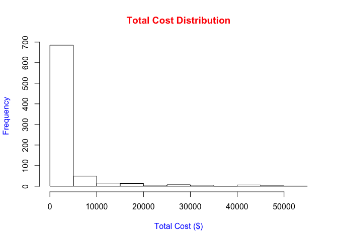
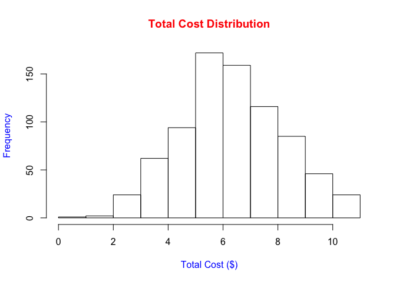
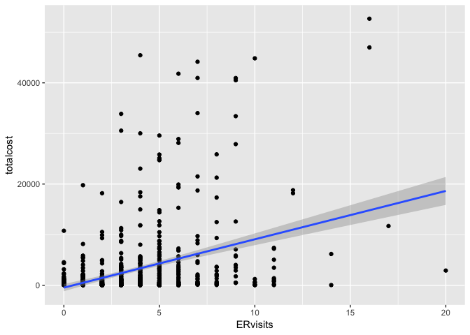
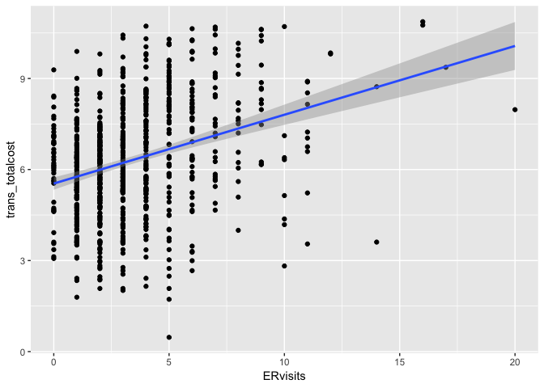

Methods\_hw4
================
Yishan Wang
2018-11-12

Problem 2
=========

``` r
heartdisease_data = read_csv("./data/HeartDisease.csv")
```

    ## Parsed with column specification:
    ## cols(
    ##   id = col_integer(),
    ##   totalcost = col_double(),
    ##   age = col_integer(),
    ##   gender = col_integer(),
    ##   interventions = col_integer(),
    ##   drugs = col_integer(),
    ##   ERvisits = col_integer(),
    ##   complications = col_integer(),
    ##   comorbidities = col_integer(),
    ##   duration = col_integer()
    ## )

### a)

#### Description of the Data Set

The main outcome is `totalcost` of patients diagnosed with heart disease. The main predictor is `ERvisits`, which is number of emergency room visits. Other important covariates are `age`, `gender`, `complications` and `duration`. `interventions`, `drugs` and `comorbidities` are potential covariates.

#### Descriptive Statistics for all Variables of Interest

##### Descriptive statistics for continous variables of interest:

``` r
heartdisease_data %>%
  select(totalcost, ERvisits, age, complications, duration) %>%
  summary()
```

    ##    totalcost          ERvisits           age        complications    
    ##  Min.   :    0.0   Min.   : 0.000   Min.   :24.00   Min.   :0.00000  
    ##  1st Qu.:  161.1   1st Qu.: 2.000   1st Qu.:55.00   1st Qu.:0.00000  
    ##  Median :  507.2   Median : 3.000   Median :60.00   Median :0.00000  
    ##  Mean   : 2800.0   Mean   : 3.425   Mean   :58.72   Mean   :0.05711  
    ##  3rd Qu.: 1905.5   3rd Qu.: 5.000   3rd Qu.:64.00   3rd Qu.:0.00000  
    ##  Max.   :52664.9   Max.   :20.000   Max.   :70.00   Max.   :3.00000  
    ##     duration     
    ##  Min.   :  0.00  
    ##  1st Qu.: 41.75  
    ##  Median :165.50  
    ##  Mean   :164.03  
    ##  3rd Qu.:281.00  
    ##  Max.   :372.00

?dplyr::select \#\#\#\#\# Descriptive statistics for categorical variable of interest:

``` r
table(factor(heartdisease_data$gender, levels = c(0, 1), labels = c('Male', 'Female'))) %>%
  addmargins()
```

    ## 
    ##   Male Female    Sum 
    ##    608    180    788

### b)

#### Plot the distribution for variable `totalcost`:

``` r
hist(heartdisease_data$totalcost, main = "Total Cost Distribution", xlab = "Total Cost ($)", col.main = "red", col.lab = "blue")
```



#### Use log transformation:

``` r
hist(log(heartdisease_data$totalcost), main = "Total Cost Distribution", xlab = "Total Cost ($)", col.main = "red", col.lab = "blue")
```



### c)

#### Create a new variable called `comp_bin` by dichotomizing `complications`: 0 if no complications, and 1 otherwise.

``` r
new_heartdisease_data = heartdisease_data %>%
  mutate(comp_bin = as.factor(ifelse(complications == 0, 0, 1))) %>%
  mutate(gender = as.factor(gender))
```

### d)

#### Fit a simple linear regression between the original `totalcost` and predictor `ERvisits`.

``` r
ggplot(heartdisease_data, aes(x = ERvisits, y = totalcost)) +
  geom_point() +
  geom_smooth(method = 'lm',formula = y~x)
```



``` r
reg_original_slr = lm(totalcost ~ ERvisits, heartdisease_data)
summary(reg_original_slr)
```

    ## 
    ## Call:
    ## lm(formula = totalcost ~ ERvisits, data = heartdisease_data)
    ## 
    ## Residuals:
    ##    Min     1Q Median     3Q    Max 
    ## -15733  -2353  -1062    185  42098 
    ## 
    ## Coefficients:
    ##             Estimate Std. Error t value Pr(>|t|)    
    ## (Intercept)  -472.54     362.24  -1.304    0.192    
    ## ERvisits      955.44      83.81  11.399   <2e-16 ***
    ## ---
    ## Signif. codes:  0 '***' 0.001 '**' 0.01 '*' 0.05 '.' 0.1 ' ' 1
    ## 
    ## Residual standard error: 6201 on 786 degrees of freedom
    ## Multiple R-squared:  0.1419, Adjusted R-squared:  0.1408 
    ## F-statistic: 129.9 on 1 and 786 DF,  p-value: < 2.2e-16

##### Comments on significance and interpretation of the slope:

#### Fit a simple linear regression between the transformed `totalcost` and predictor `ERvisits`.

``` r
trans_heartdisease_data = heartdisease_data %>%
  filter(totalcost != 0) %>%
  mutate(trans_totalcost = log(totalcost)) 

ggplot(trans_heartdisease_data, aes(x = ERvisits, y = trans_totalcost)) +
  geom_point() +
  geom_smooth(method = 'lm', formula = y~x)
```



``` r
reg_trans_slr = lm(trans_totalcost ~ ERvisits, trans_heartdisease_data)
summary(reg_trans_slr)
```

    ## 
    ## Call:
    ## lm(formula = trans_totalcost ~ ERvisits, data = trans_heartdisease_data)
    ## 
    ## Residuals:
    ##     Min      1Q  Median      3Q     Max 
    ## -6.2013 -1.1265  0.0191  1.2668  4.2797 
    ## 
    ## Coefficients:
    ##             Estimate Std. Error t value Pr(>|t|)    
    ## (Intercept)  5.53771    0.10362   53.44   <2e-16 ***
    ## ERvisits     0.22672    0.02397    9.46   <2e-16 ***
    ## ---
    ## Signif. codes:  0 '***' 0.001 '**' 0.01 '*' 0.05 '.' 0.1 ' ' 1
    ## 
    ## Residual standard error: 1.772 on 783 degrees of freedom
    ## Multiple R-squared:  0.1026, Adjusted R-squared:  0.1014 
    ## F-statistic:  89.5 on 1 and 783 DF,  p-value: < 2.2e-16

##### Comments on significance and interpretation of the slope:

### c)

#### Fit a multiple linear regression with `comp_bin` and `ERvisits` as predictors.

``` r
reg_original_mlr = lm(totalcost ~ ERvisits + comp_bin, new_heartdisease_data)
summary(reg_original_mlr)
```

    ## 
    ## Call:
    ## lm(formula = totalcost ~ ERvisits + comp_bin, data = new_heartdisease_data)
    ## 
    ## Residuals:
    ##    Min     1Q Median     3Q    Max 
    ## -14631  -2183   -993    218  42351 
    ## 
    ## Coefficients:
    ##             Estimate Std. Error t value Pr(>|t|)    
    ## (Intercept)  -511.90     358.65  -1.427    0.154    
    ## ERvisits      902.26      83.93  10.750  < 2e-16 ***
    ## comp_bin1    4058.94     973.98   4.167 3.42e-05 ***
    ## ---
    ## Signif. codes:  0 '***' 0.001 '**' 0.01 '*' 0.05 '.' 0.1 ' ' 1
    ## 
    ## Residual standard error: 6138 on 785 degrees of freedom
    ## Multiple R-squared:  0.1604, Adjusted R-squared:  0.1583 
    ## F-statistic: 75.01 on 2 and 785 DF,  p-value: < 2.2e-16

##### I)

##### Test if `comp_bin` is an effect modifier of the relationship between `totalcost` and `ERvisits`.

``` r
reg_interaction = lm(totalcost ~ ERvisits + comp_bin + ERvisits * comp_bin, new_heartdisease_data)
summary(reg_interaction)
```

    ## 
    ## Call:
    ## lm(formula = totalcost ~ ERvisits + comp_bin + ERvisits * comp_bin, 
    ##     data = new_heartdisease_data)
    ## 
    ## Residuals:
    ##    Min     1Q Median     3Q    Max 
    ## -14938  -2177   -977    256  42338 
    ## 
    ## Coefficients:
    ##                    Estimate Std. Error t value Pr(>|t|)    
    ## (Intercept)          -573.2      366.4  -1.564  0.11814    
    ## ERvisits              920.7       86.9  10.594  < 2e-16 ***
    ## comp_bin1            5430.0     1935.0   2.806  0.00514 ** 
    ## ERvisits:comp_bin1   -275.6      336.1  -0.820  0.41243    
    ## ---
    ## Signif. codes:  0 '***' 0.001 '**' 0.01 '*' 0.05 '.' 0.1 ' ' 1
    ## 
    ## Residual standard error: 6139 on 784 degrees of freedom
    ## Multiple R-squared:  0.1612, Adjusted R-squared:  0.158 
    ## F-statistic: 50.21 on 3 and 784 DF,  p-value: < 2.2e-16

##### Comment

##### II)

##### Test if `comp_bin` is a confounder of the relationship between `totalcost` and `ERvisits`.

##### Comment

##### III)

### f)

##### I)

##### Use the model in part e) and add additional covariates and fit MLR.

``` r
full_model = lm(totalcost ~ ERvisits + comp_bin + age + gender + duration, new_heartdisease_data)
summary(full_model)
```

    ## 
    ## Call:
    ## lm(formula = totalcost ~ ERvisits + comp_bin + age + gender + 
    ##     duration, data = new_heartdisease_data)
    ## 
    ## Residuals:
    ##    Min     1Q Median     3Q    Max 
    ## -13262  -2391   -977    591  40793 
    ## 
    ## Coefficients:
    ##              Estimate Std. Error t value Pr(>|t|)    
    ## (Intercept)  4104.112   1903.052   2.157 0.031341 *  
    ## ERvisits      892.281     84.166  10.601  < 2e-16 ***
    ## comp_bin1    3708.979    963.774   3.848 0.000129 ***
    ## age           -93.729     32.343  -2.898 0.003861 ** 
    ## gender1     -1022.046    517.144  -1.976 0.048469 *  
    ## duration        7.159      1.823   3.928 9.33e-05 ***
    ## ---
    ## Signif. codes:  0 '***' 0.001 '**' 0.01 '*' 0.05 '.' 0.1 ' ' 1
    ## 
    ## Residual standard error: 6055 on 782 degrees of freedom
    ## Multiple R-squared:  0.1862, Adjusted R-squared:  0.181 
    ## F-statistic: 35.78 on 5 and 782 DF,  p-value: < 2.2e-16

##### Comment

##### II)

``` r
anova(reg_original_slr, full_model)
```

    ## Analysis of Variance Table
    ## 
    ## Model 1: totalcost ~ ERvisits
    ## Model 2: totalcost ~ ERvisits + comp_bin + age + gender + duration
    ##   Res.Df        RSS Df  Sum of Sq      F    Pr(>F)    
    ## 1    786 3.0228e+10                                   
    ## 2    782 2.8668e+10  4 1560105852 10.639 2.127e-08 ***
    ## ---
    ## Signif. codes:  0 '***' 0.001 '**' 0.01 '*' 0.05 '.' 0.1 ' ' 1

Problem 3
=========

``` r
patsatisfaction_data = readxl::read_excel("./data/PatSatisfaction.xlsx") %>%
  janitor::clean_names()
```

### a)

#### Create a correlation matrix

``` r
Hmisc::rcorr(as.matrix(patsatisfaction_data))
```

    ##              safisfaction   age severity anxiety
    ## safisfaction         1.00 -0.79    -0.60   -0.64
    ## age                 -0.79  1.00     0.57    0.57
    ## severity            -0.60  0.57     1.00    0.67
    ## anxiety             -0.64  0.57     0.67    1.00
    ## 
    ## n= 46 
    ## 
    ## 
    ## P
    ##              safisfaction age severity anxiety
    ## safisfaction               0   0        0     
    ## age           0                0        0     
    ## severity      0            0            0     
    ## anxiety       0            0   0

##### Initial Findings

### b)

##### Fit a multiple regression model and test whether there is a regression relation and test whether there is a regression relation.

``` r
reg_mlr = lm(safisfaction ~ age + severity + anxiety, patsatisfaction_data)
summary(reg_mlr)
```

    ## 
    ## Call:
    ## lm(formula = safisfaction ~ age + severity + anxiety, data = patsatisfaction_data)
    ## 
    ## Residuals:
    ##      Min       1Q   Median       3Q      Max 
    ## -18.3524  -6.4230   0.5196   8.3715  17.1601 
    ## 
    ## Coefficients:
    ##             Estimate Std. Error t value Pr(>|t|)    
    ## (Intercept) 158.4913    18.1259   8.744 5.26e-11 ***
    ## age          -1.1416     0.2148  -5.315 3.81e-06 ***
    ## severity     -0.4420     0.4920  -0.898   0.3741    
    ## anxiety     -13.4702     7.0997  -1.897   0.0647 .  
    ## ---
    ## Signif. codes:  0 '***' 0.001 '**' 0.01 '*' 0.05 '.' 0.1 ' ' 1
    ## 
    ## Residual standard error: 10.06 on 42 degrees of freedom
    ## Multiple R-squared:  0.6822, Adjusted R-squared:  0.6595 
    ## F-statistic: 30.05 on 3 and 42 DF,  p-value: 1.542e-10

##### State the hypotheses, decision rule and conclusion.

### c)

``` r
confint(reg_mlr, level = 0.95)
```

    ##                  2.5 %      97.5 %
    ## (Intercept) 121.911727 195.0707761
    ## age          -1.575093  -0.7081303
    ## severity     -1.434831   0.5508228
    ## anxiety     -27.797859   0.8575324

##### Interpret the coefficient and 95% CI associated with `severity`.

### d)

##### Obtain an interval estimate for a new patient’s satisfaction when Age = 35, Severity = 42, Anxiety = 2.1.

``` r
mean_Y_hat = function(dataset, x, y, n, conf.level = 0.95){

  reg = lm(y ~ x)
  
#Get the number of observations n
  n = dim(dataset)[1]
  
  Upper_limit = reg$coefficients[1] + reg$coefficients[2]*x +
    qt(0.5*(1 + conf.level), n - 2) * sqrt(sigma(reg)^2*(1/n + (x - mean(x))^2/sum((x - mean(x))^2)))
  Lower_limit = reg$coefficients[1] + reg$coefficients[2]*x -
    qt(0.5*(1 + conf.level), n - 2) * sqrt(sigma(reg)^2*(1/n + (x - mean(x))^2/sum((x - mean(x))^2)))
  list(Upper_limit, LL = Lower_limit)
}
```

?dim
